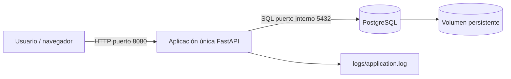

# Arquitectura de Horizonte Inventory

Horizonte Inventory funciona completamente dentro de una única máquina virtual
Ubuntu Server 22.04. La aplicación no depende de Kubernetes, servicios en la
nube ni bases de datos externas.

## Componentes

- **FastAPI:** interfaz web, API CRUD, filtros y endpoint `/health`.
- **PostgreSQL:** tabla `products` y persistencia del inventario.
- **Docker Compose:** inicio y detención reproducibles dentro de la VM.
- **Archivo de log:** registra arranque, solicitudes, operaciones CRUD y errores.
